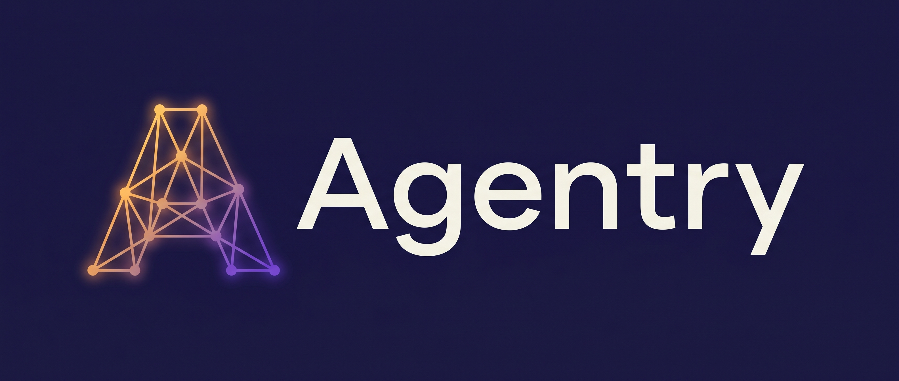
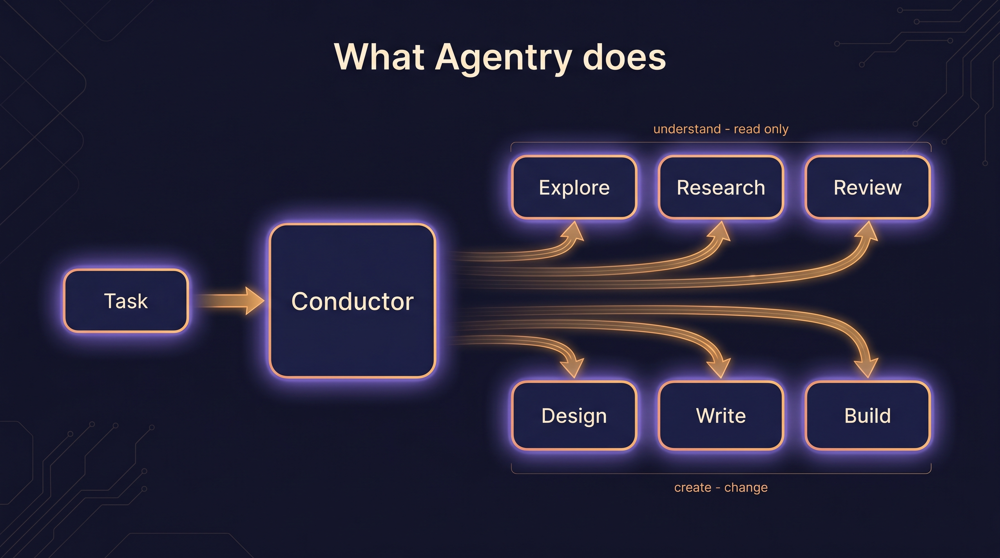
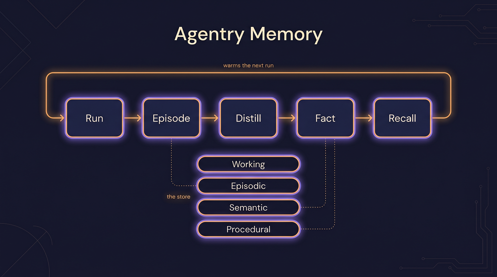
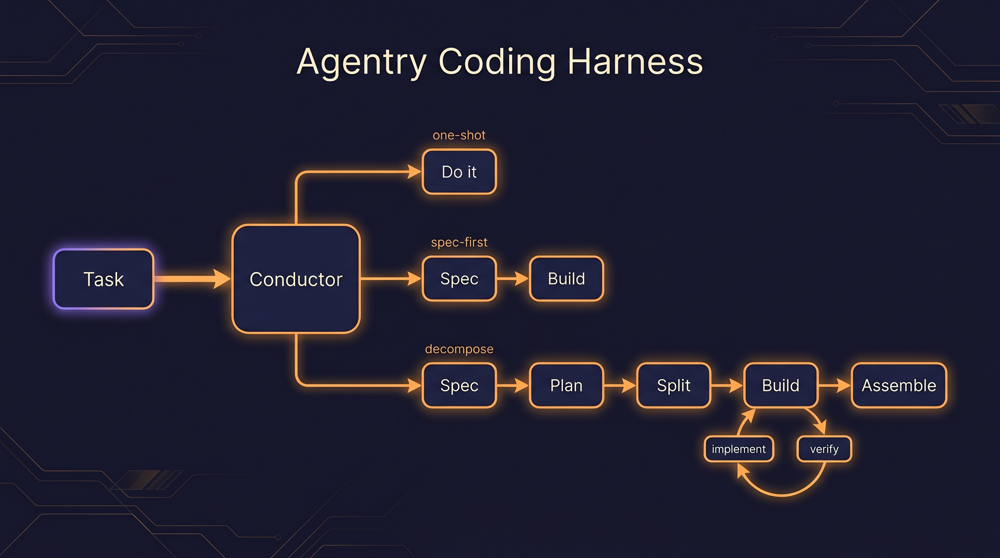

<p align="center">
  
</p>

<p align="center">
  <b>An adaptive agentic layer for Claude Code.</b><br>
  Same model — disciplined structure around it, and a memory that compounds.
</p>

<p align="center">
  <code>v0.1</code> &nbsp;·&nbsp; <code>measured · controlled · reproducible</code> &nbsp;·&nbsp; <code>Node ≥ 24</code> &nbsp;·&nbsp; <code>MIT</code>
</p>

---

Agentry wraps Claude Code in **right-sized orchestration**, a roster of **SDLC specialists**, and
**durable memory**. It applies the *least process that wins*: trivial work goes one-shot with no
orchestration tax; hard work earns a spec, a plan, and independent verification. The model doesn't
change — the **conducting, the specialists, and the learning memory are the product**.

And unusually for this category: **we measure it.** Agentry ships a self-evaluation harness that scores
its own routing, decision quality, and memory-compounding — every number controlled, read from real work
artifacts, and reproducible from one command. Not asserted. *Measured.*

<p align="center">
  
</p>

## Why it exists

Dropping a powerful model into a hard task and hoping is not engineering. Teams want the *judgment* of a
senior engineer: knowing when a one-liner is a one-liner and when a "small change" hides a load-bearing
decision; spec'ing before building when it matters; never re-deciding what was already decided last week.

Agentry encodes that judgment as a system — and then holds itself to it with an eval that keeps catching
its *own instrument* being wrong.

## The three pillars

### 1 · The brain — a conductor that right-sizes the work


A conductor (the main session) routes every task to the **least process that wins** —
`one-shot → spec-first → decompose+verify` — and dispatches specialist subagents only when the work earns
them. It's **biased to the floor** and escalates *on evidence*: a hidden decision fork vetoes a one-shot;
multiple coupled components earn a decompose. It never re-implements what a specialist or a node already does.

<br clear="left">

### 2 · Memory — the moat that compounds



A local, **zero-install** MCP. **Text files are the source of truth; a derived `node:sqlite` index** powers
recall. Recall ranks by *relevance × confidence × usefulness*, auto-writes through a write-bar, auto-prunes
by decay, and runs a graduation pipeline (**episodes → facts → skills**) so the store gets *warm*. The
payoff, **measured** (see below): the second time Agentry meets a decision it settled before, it **recalls
it, applies it, and routes the task lighter** — spec-first becomes one-shot.

### 3 · The harness — breadth without the orchestration tax



A roster of capability-first specialists wraps the model in an SDLC: explore → research → spec → plan →
split → implement → verify → assemble → reflect → remember. Each is a preloaded **skill**; each uses
*whatever tools you have* (Serena, web search, a browser MCP…) and degrades gracefully when one's absent.
No tool allowlists.

## Does it actually work? — yes, and we measure it

We don't lead with a hero number. We lead with **how we know** — because the trust machinery *is* the
product. Every number is gated by controls before it's shown, and read from the conductor's **real work
artifacts**, never a proxy.

| Dimension | What it measures | Result | Trust controls |
| :--- | :--- | :--- | :--- |
| **Routing** | Does it right-size to the labeled floor? | **100%** to-floor · **88.9% ± 15.7%** across repeats | A/A unanimity · saturation guard · planted positive |
| **Decision quality** | Is the spec/plan senior-grade? | **97.5%** over 12 judged artifacts | gold **100%** ↔ poor **20%** discrimination · A/A judge σ = 0 |
| **Memory moat** | Does recall make work route lighter? | **compounds** — spec-first → one-shot; discrimination **1.0** | decoy control · seed-landing gate |

> **The corrections log is the real story.** Building the instrument, it disagreed with the conductor **six
> times** — and *every time, the conductor was right and the meter was wrong* (a proxy that scored an
> escalation as a one-shot; a timing bug that killed a slow planner; an "under-route" that was actually a
> good decision shipping a 98%-quality spec). We fixed the **meter**, not the conductor. A number that
> survived its own instrument being wrong six times is a number you can believe.

**Reproduce it yourself** — the eval is self-contained and runs through the real front door:

```bash
cd packages/eval && npm install
npm run selfeval -- run routing  --fixture fixtures/routing-quick --runs 3 --plugin-dir ../..
npm run selfeval -- run quality  --from-run <run-id>      # judges stored specs — zero re-run
npm run selfeval -- run moat     --fixture fixtures/moat   --plugin-dir ../..
npm run selfeval -- report       <run-id>                 # → a self-contained dashboard HTML
```

`report` emits a single static dashboard (routing accuracy, decision quality, the memory moat, and the
corrections log) — *run the eval, get the page.*

## The roster

| Team | Specialists |
| :--- | :--- |
| **Dev** | explorer · researcher · architect · implementer · verifier · librarian |
| **Product** | product-owner · designer |

Each agent's craft is a preloaded **skill** (13 — `conducting`, `architecting`, `planning`, `implementing`,
`testing`, `reviewing`, `integrating`, `exploring`, `researching`, `remembering`, `product`, `writing`,
`designing`). Agents are **capability-first**: no `tools:` allowlists; they use what you have and degrade
gracefully.

## Commands

- **`/agentry:go <task>`** — the front door. Routes and conducts.
- Nodes (standalone + composable): `/agentry:onboard · :research · :spec · :plan · :split · :implement ·
  :verify · :assemble · :reflect · :remember`

## Install

**Requires Node ≥ 24** (the memory MCP uses the built-in `node:sqlite`). From a Claude Code session:

```
/plugin marketplace add Codestz/agentry
/plugin install agentry@agentry-dev
```

Restart the session (agents, hooks, and the `mem` MCP load at startup), then:

```
/agentry:onboard                                       # warm memory on this repo (read-only)
/agentry:go "add pagination to the users endpoint"     # the adaptive front door routes it
```

## Repository layout

```
agentry/                  # repo root = the Claude Code plugin
├── .claude-plugin/       # plugin + marketplace manifests + inline `mem` MCP wiring
├── agents/ commands/ skills/ hooks/   # the shipped plugin payload (markdown + a dep-free primer hook)
├── packages/
│   ├── core/             # @agentry/core — the typed contract (the single source of truth)
│   ├── memory/           # @agentry/memory — the durable memory MCP (file-store truth + sqlite index)
│   └── eval/             # the self-evaluation harness — routing · quality · moat · reporter
└── scripts/              # check-plugin structure gate
```

## How it's designed

Agentry is designed the way it asks *you* to work: win-conditions and success metrics written up front, a
strict code bar (SRP, types in one place, right-sized structure), and ports-and-adapters where it counts
(the memory MCP). The design is captured in 12 internal documents — and, more convincingly, in an eval that
holds the system to the bar and **corrects the instrument, not the result, when they disagree.**

## License

MIT
