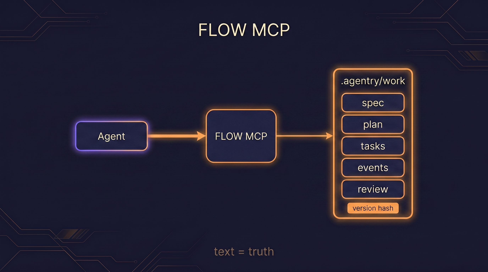
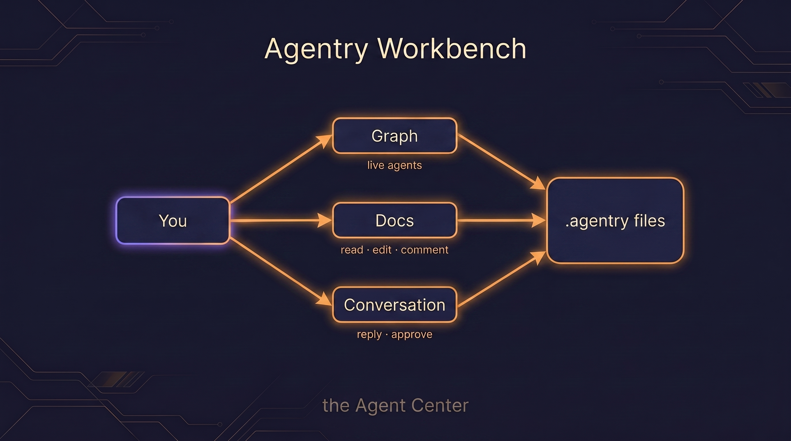
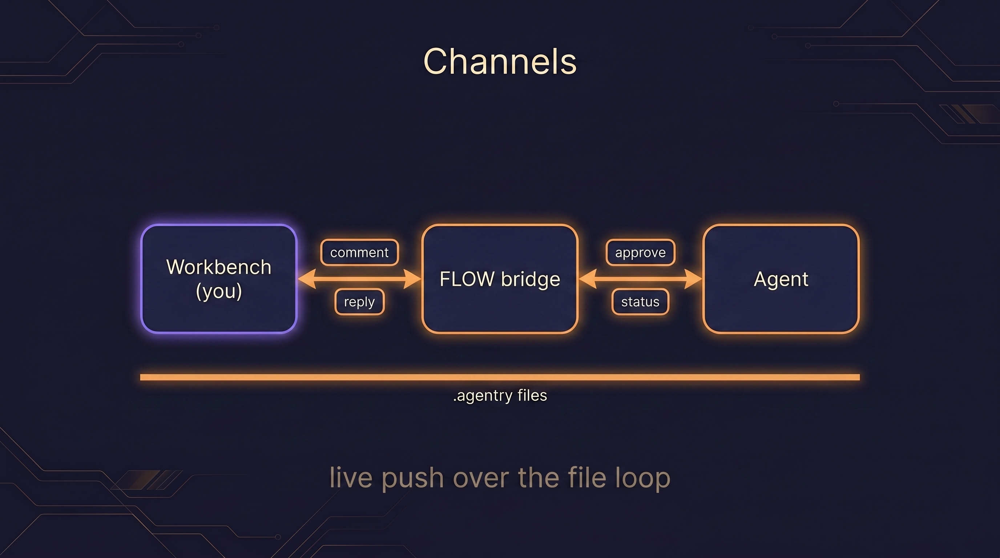

<p align="center">
  
</p>

<p align="center">
  <b>An adaptive agentic layer for Claude Code.</b><br>
  Right-sized orchestration · SDLC specialists · durable memory that compounds.
</p>

<p align="center">
  <code>v0.1 · pre-1.0</code> &nbsp;·&nbsp; <code>Node ≥ 24</code> &nbsp;·&nbsp; <code>MIT</code>
</p>

---

Agentry wraps Claude Code in **right-sized orchestration**, a roster of **SDLC specialists**, and **durable
memory**. You give it a task through one front door — **`/agentry:go <task>`** — and it picks the *least
process that wins*: a one-liner goes straight to a fix; a tangled feature earns a spec, a plan, independent
verification, and a clean merge. The model doesn't change. The conducting, the specialists, and the learning
memory are the product.

<p align="center">
  
</p>

## Install

**Requires Node ≥ 24** — the memory engine uses Node's built-in `node:sqlite` (no native modules, nothing to
compile). From a Claude Code session:

```
/plugin marketplace add Codestz/agentry
/plugin install agentry@agentry-dev
```

Restart the session — agents, commands, and the bundled MCP servers load at startup. Then:

```
/agentry:onboard                                       # warm memory on this repo (read-only)
/agentry:go "add pagination to the users endpoint"     # the front door routes and conducts it
```

That's the whole setup. You can run Agentry entirely from the terminal; the web Workbench and live channels
below are **optional** add-ons.

## How it works — the right-sizing harness

`/agentry:go` routes every task to the **least process that wins**, then conducts it. The conductor (your main
session) is biased to the floor and escalates only on evidence:

| Shape | When it's used | What runs |
| :--- | :--- | :--- |
| **one-shot** | a clear, reversible change with no hidden decision | a single bounded edit, then verify |
| **spec-first** | "done = X" isn't clear yet, or the ask is product-shaped | shape a Spec with observable acceptance criteria, gate it, then build |
| **decompose + verify** | multiple coupled parts, real design forks | spec → plan → split into tasks → build → verify → assemble |

A hidden decision fork vetoes a one-shot; several coupled components earn a decompose. Once work is built and
verified, the last mile has one bar: **done = merged + green.** At each step the conductor dispatches specialist
subagents only when the work earns them, and **gates approvals with you** — you stay in the loop at every fork.

<p align="center">
  
</p>

## The specialists

Each agent owns one slice of the SDLC. Its craft comes from preloaded **skills**, and it is **capability-first** —
no tool allowlists; it uses whatever you have (Serena, web search, a browser MCP) and degrades gracefully when
one's absent. The conductor dispatches a specialist only when the work needs it.

| Agent | Owns |
| :--- | :--- |
| **product-owner** | the *what & why* — turns "make X better" into a Spec with observable acceptance criteria; also docs, READMEs, release notes |
| **architect** | sound structure — module boundaries, ADRs, a Plan with an architecture map, then bounded Task contracts |
| **implementer** | clean, bounded code **and tests** to a Task contract; also the debugging mode (reproduce → fix the smallest thing → prove it) |
| **designer** | UX/UI craft — hierarchy, layout, accessibility, design-system fit — verified against the **rendered** result |
| **verifier** | adversarial, **independent** verification against acceptance + a security lens; returns a Verdict, never fixes |
| **explorer** | read-only comprehension of an existing codebase → a Context map (where things live, conventions, how data flows) |
| **researcher** | investigates genuine unknowns (a library's current API, an external standard) → **cited** findings + implications |
| **librarian** | runs the memory flows — curate, distill (episodes → facts), and *propose* skills (human-gated) |

Every step is also a standalone command (`/agentry:spec`, `/agentry:plan`, `/agentry:implement`, `/agentry:verify`,
`/agentry:ship`, …) emitting one typed artifact. `/agentry:go` chains them for you; you can also drive a single
one by hand — same machinery, one shared contract.

## Architecture

The **repo root is the plugin marketplace.** `plugin/` is the **shipped payload** — installing copies only that
directory, never the dev tree. TypeScript dev packages live under `packages/` and build down into the committed,
zero-install bundles inside `plugin/`.

| Where | What it is |
| :--- | :--- |
| `plugin/` | the **shipped plugin** — `agents/ commands/ skills/ hooks/` + the committed `mem`, `flow`, and `workbench` bundles |
| `plugin/.claude-plugin/plugin.json` | the manifest — wires the `mem` and `flow` MCP servers inline (`${CLAUDE_PLUGIN_ROOT}/…/index.js`) |
| `.claude-plugin/marketplace.json` | the marketplace manifest (stays at the repo root; `source: "./plugin"`) |
| `packages/core` | `@agentry/core` — the single typed contract every node shares |
| `packages/memory` | the memory MCP → builds to `plugin/mem/index.js` |
| `packages/flow` | the FLOW MCP → builds to `plugin/flow/index.js` |
| `packages/workbench` · `packages/web` | the Workbench app + site → build to `plugin/workbench/` |
| `packages/eval` | the self-evaluation harness |

Two of these bundles are **always on** — the substrate Agentry can't run without. The rest are additive.

## FLOW — the orchestration engine (mandatory)

FLOW is the in-run engine. It records every run's state to plain files under `.agentry/work/<run>/` — and **those
files are the truth.** Text is the source of record; the engine is stateless over it. Kill the session mid-run and
restart, and nothing is lost — the files hold the whole run, so it resumes cold.

FLOW gives the conductor:

- **Task lifecycle + status** — each task's state (`todo · in-progress · in-review · done · blocked`) and its lock
  (`lockedBy`), so two builders never clobber the same file.
- **An append-only event log** (`events.jsonl`) — routing, gates, node-enter/done, agent states — the run's timeline.
- **A review sidecar** (`.review/<gate>.json`) — comments anchored to a span of an artifact, with the 3-way anchor
  that lets the agent relocate them after edits.
- **A content-hash `version`** stamped on every artifact write — so a save against a stale version is rejected
  (optimistic concurrency), and any change is a diff.

<p align="center">
  
</p>

## Memory — the moat that compounds (mandatory)

A local, **zero-install** MCP (stdio, `node:sqlite`). **Text files are the source of truth; a derived SQLite index
powers recall.** It's project-rooted with a global root alongside, so facts and episodes follow the work.

Recall is **task-specific** — pulled per task, ranked by relevance × confidence × usefulness, never a session-start
dump. Writes pass a write-bar; stale facts decay; a graduation pipeline turns **episodes → facts → skills**. The
payoff: the second time Agentry meets a decision it settled before, it recalls it, applies it, and routes the task
lighter — spec-first becomes one-shot. **Run #2 is warmer than run #1.**

## Workbench — the Agent Center (optional)

The Workbench is a per-project local web app for *acting on* a run's work — a second client beside the chat
session, over the same `.agentry/` files. Read, **edit, comment on, and approve** the spec / plan / tasks, and
**watch and steer** the agents on a live graph of the run. Your edits are authoritative: the agent reads them
back next turn.

One server per project on a fixed port (`:4317`); each run gets its own URL by host-routing
(`<run>.localhost:4317`, no `/etc/hosts` edit). Launch or focus it with `/agentry:workbench [run]`. It is **stateless
over the files** — kill it and the run is untouched; the `.agentry/` tree is the state.

**Optional:** you can conduct an entire run from the terminal and never open it.

<p align="center">
  
</p>

## Channels — live human ↔ agent steering (optional)

By default the Workbench loop is **async**: you edit a file, the agent reads it on its next turn. Channels add a
**live push layer over that file-watch loop** — the human ↔ agent link goes real-time:

- **Live review comments** and threaded replies (`channel_reply`) — pushed into the session, not waited for at the
  next gate.
- **A permission relay** — approve or deny a tool-use from the Workbench instead of the terminal; whichever side
  answers first wins.
- **Human status changes that steer the agent** — force a task back to `todo` to redo it, or to `done`, and the
  agent re-reads and adjusts.

Channels are a **research-preview** feature. They require launching Claude Code with the development flag:

```
claude --dangerously-load-development-channels plugin:agentry@agentry-dev
```

<p align="center">
  
</p>

## What's mandatory, what's optional

Memory and FLOW are the only hard requirements. Everything above them is additive — turn it off and the run still
completes, because **the files are always the truth.**

| Layer | Required? | Turn it off and… |
| :--- | :--- | :--- |
| **Memory** | **Yes** | — (the always-on store; run #2 is warmer than #1) |
| **FLOW** | **Yes** | — (the always-on engine; the run's state lives in `.agentry/`) |
| **Workbench** | No | conduct the whole run from the terminal, exactly as normal |
| **Channels** | No | everything still works via the async file-watch loop — the agent reads your edits next turn, and tool approvals fall back to the terminal dialog |

In short: the Workbench and channels are *better ways to watch and steer*; they are never the thing that makes a
run work. The terminal-only path is a first-class path.

## Does it work? — yes, and we measure it

Agentry ships a self-evaluation harness that scores its own routing, decision quality, and memory-compounding —
every number gated by controls and read from real work artifacts, never a proxy. Reproduce it yourself:

```bash
cd packages/eval && npm install
npm run selfeval -- run routing  --fixture fixtures/routing-quick --runs 3 --plugin-dir ../..
npm run selfeval -- run quality  --from-run <run-id>      # judges stored specs — zero re-run
npm run selfeval -- run moat     --fixture fixtures/moat   --plugin-dir ../..
npm run selfeval -- report       <run-id>                 # → a self-contained dashboard HTML
```

## Repo layout & dev

```
plugin/            the shipped plugin (agents · commands · skills · hooks · mem · flow · workbench)
packages/          TypeScript dev sources (core · memory · flow · workbench · web · eval)
.docs/internal/    the design docs — read these before changing behavior
```

Two standing rules if you hack on the bundles: any change to a `packages/*/src` that ships must rebuild and commit
its `plugin/` dist in the same change (**dist-lockstep**), and `node scripts/check-plugin.mjs` must pass before
every commit. See [`CONTRIBUTING.md`](./CONTRIBUTING.md) for the full dev setup and the bar a change is held to.

## Maturity & license

**v0.1, pre-1.0.** The shape is settled and the core paths are exercised, but contracts can still change between
versions and the channels layer rides Claude Code's research preview. Use it, file issues, expect some churn.

MIT.
